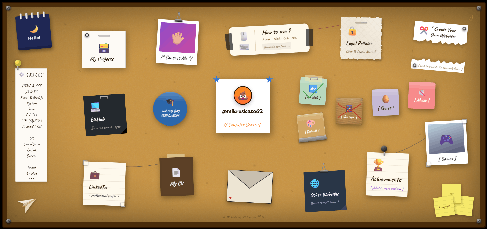
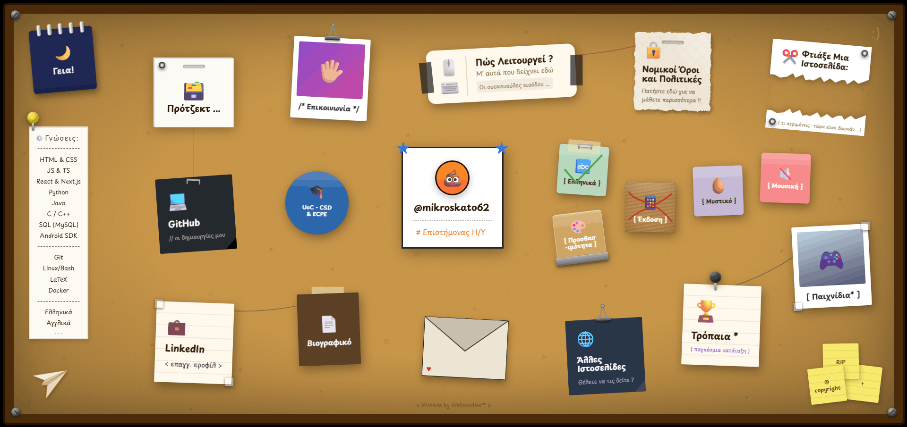
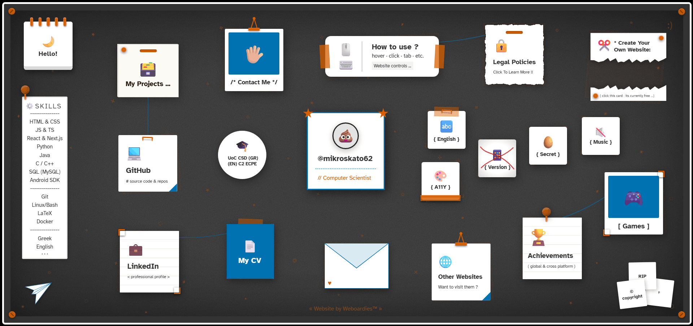
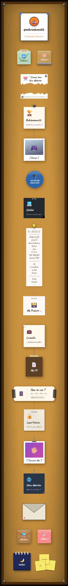
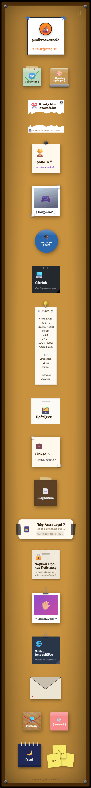
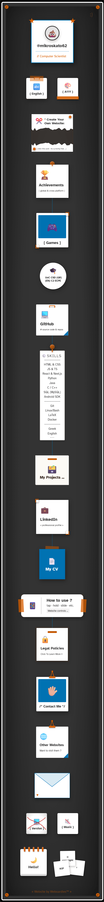

<!---------------------------------------- Copyright © 2026 Petrakis Rafail Ioannis (Weboardies™) - All Rights Reserved. ------------------------------------------> 
<!--------------------------------------------------------------------------------------------------------------------------| 
▄▄▄▄▄▄▄▄▄▄▄▄▄▄▄▄▄▄▄▄▄▄▄▄▄▄▄▄▄▄▄▄▄▄▄▄▄▄▄▄▄▄▄▄▄▄▄▄▄▄▄▄▄▄▄▄▄▄▄▄▄▄▄▄▄▄▄▄▄▄▄▄▄▄▄▄▄▄▄▄▄▄▄▄▄▄▄▄▄▄▄▄▄▄▄▄▄▄▄▄▄▄▄▄▄▄▄▄▄▄▄▄▄▄▄▄▄▄▄▄▄▄▄▄▄
█                                                                                                                           █
█   ████      ███   ███   ██   ██   ██   ██████    ████     ████    ██   ██    ████      ██      ████    █████      █████   █
█  ██   ███   ██ ███ ██        ██  ██    ██   ██  ██  ██   ██       ██  ██        ██   ██████   ██  ██   ██        ██   ██  █
█  ██ ██  █   ██  █  ██   ██   █████     ██       ██  ██    ███     █████      █████     ██     ██  ██   ██████       ███   █
█  ██    ██   ██     ██   ██   ██  ██    ██       ██  ██      ██    ██  ██    ██  ██     ██     ██  ██   ██   ██    ███     █
█   ██████    ██     ██   ██   ██   ██   ██        ████    ████     ██   ██    █████      ███    ████    █████    ███████   █
█                                                                                                                           █
▀▀▀▀▀▀▀▀▀▀▀▀▀▀▀▀▀▀▀▀▀▀▀▀▀▀▀▀▀▀▀▀▀▀▀▀▀▀▀▀▀▀▀▀▀▀▀▀▀▀▀▀▀▀▀▀▀▀▀▀▀▀▀▀▀▀▀▀▀▀▀▀▀▀▀▀▀▀▀▀▀▀▀▀▀▀▀▀▀▀▀▀▀▀▀▀▀▀▀▀▀▀▀▀▀▀▀▀▀▀▀▀▀▀▀▀▀▀▀▀▀▀▀▀▀
|--------------------------------------------------------------------------------------------------------------------------->

<a id="top"></a> 

<div align="center">
  <a href="https://www.weboardies.com">
    <abbr title="Weboardies™">
      
    </abbr>
  </a>
</div>
<div align="center">
  <strong>
    Build your personal website and pin it to the web!
  </strong>
</div>
<br>
<div align="center">
  &nbsp;
  <a href="https://www.weboardies.com"><kbd><br>&nbsp;&nbsp;Official&nbsp;Website&nbsp;&nbsp;<br><br></kbd></a>
  &nbsp;&nbsp;
  <a href="https://www.weboardies.com/mikroskato62"><kbd><br>&nbsp;&nbsp;Live&nbsp;Demo&nbsp;&nbsp;<br><br></kbd></a>
  &nbsp;&nbsp;
  <a href="#table-of-contents"><kbd><br>&nbsp;&nbsp;Learn&nbsp;More&nbsp;&nbsp;<br><br></kbd></a>
  &nbsp;
</div>

<br>

<a id="table-of-contents"></a>
---

### 📑 Table of Contents

• 📌 [Weboardies™](#top) \
• 📑 [Table of Contents](#table-of-contents) \
• 💡 [About](#about) \
• 📸 [Screenshots](#screenshots) \
• ⚙️ [How It Works](#how-it-works) \
• ✨ [Key Features](#key-features) \
• 🛠️ [Tech Stack](#tech-stack) \
• 🏗️ [Architecture Overview](#architecture-overview) \
• 🌱 [Project Evolution](#project-evolution) \
• 🚀 [Performance Metrics](#performance-metrics) \
• 🚦 [Project Status](#project-status) \
• 📁 [Repository Files](#repository-files) \
• 👤 [Creator](#creator) \
• 🛡️ [License & Privacy](#license--privacy) \
• ❤️ [Thanks](#thank-you)

<a id="about"></a>
---

### 💡 About

**Weboardies™** is a full-stack website builder that lets anyone create, customize, and publish a personal website styled as an interactive corkboard. Designed with a strict focus on user experience, it delivers lightning-fast load times, absolute privacy with zero tracking cookies, and seamless cross-device browser compatibility. Instead of generic templates, every site it produces looks and feels handcrafted—featuring a wide variety of card styles, realistic fasteners, interactive animations, and freely draggable layouts. Designing a board with 100+ editable fields requires no account at all, and publishing to a unique public URL is completely free.

The project was built from scratch as a solo, end-to-end endeavor in modern web development. It covers everything from authentication and database design to a custom client-side rendering engine, accessibility compliance, and serverless production deployment. While the source code remains in a private repository under a proprietary license, this public repository exists to showcase the project's technical architecture and system design for portfolio and recruitment purposes.

> [!NOTE] 
> **Weboardies™** is currently in early access, meaning i am still building the experience!

> [!IMPORTANT] 
> Customizing boards is completely free - simply create an account to publish them.

> [!WARNING] 
> The app is actively evolving, which might occasionally cause temporary instability.

> [!CAUTION] 
> Minor visual quirks or bugs might also occasionally occur while using the platform.

> [!TIP] 
> The Discord server is the only place to connect with the community - everyone's welcome!

<a id="screenshots"></a>
---

### 📸 Screenshots

<div align="center">
  
</div>

<br>

<details>
<summary><strong>Expand to view more screenshots ...</strong></summary>

<div align="center">

  <h3>* Compressed & Non-Animated Images Of My Created Website *</h3>

  <h4>[<a href="#screenshots">#0</a>] Desktop Version (Again) - Default Mode:</h4>
  
  
  <h4>[<a href="#screenshots">#1</a>] Desktop Version - (Greek) Translation Mode:</h4>
  
  
  <h4>[<a href="#screenshots">#2</a>] Desktop Version - (A11Y) Accessibility Mode:</h4>
  

  <h4>[<a href="#screenshots">#3</a>] Mobile & Tablet Version - (Main) Default Mode:</h4>
  
  
  <h4>[<a href="#screenshots">#4</a>] Mobile & Tablet Version - (Greek) Translation Mode:</h4>
  
  
  <h4>[<a href="#screenshots">#5</a>] Mobile & Tablet Version - (A11Y) Accessibility Mode:</h4>
  

  <br><br>
  ⬆️ <a href="#screenshots">Back To Screenshots</a> ⬆️

</div>

</details>

<a id="how-it-works"></a>
---

### ⚙️ How It Works

```
​ ⋆ Weboardies™ ‍〡 Create      ┌──────────────────────────────────────────────────────────────┐      ⭒ ​
​ Your Personal Website ⋆      │                 Repeat (everything is free)                  │        ​
​                              ∇                                                              │        ​
​┌───────────────┐      ┌──────────────┐     ┌──────────────┐     ┌─────────────┐      ┌──────┴──────┐ ​
​│    Landing    │─────▸│    Visual    │     │   Authen-    │┄┄┄┄▸│  User       │      │  Published  │ ​
​│    Page       │      │    Editor    │┄┄┄┄▸│   tication   │     │  Dashboard  │─────▸│  Website    │ ​
​└───────────────┘      └──────────────┘     └──────────────┘     └─────────────┘      └─────────────┘ ​
​        ⋮                      ⋮                    ⋮                    ⋮                     ⋮        ​
​• Explore product   • Design/Edit board    • Create account    • Manage profile   • Public unique URL ​
​• Live demo board   • Real-time preview    • Claim username    • Preview website  • Fast & responsive ​
​• Legal policies    • Remembers settings   • Verify it's you   • Publish changes  • 100% cookie-free  ​
```

<a id="key-features"></a>
---

### ✨ Key Features

<details>
<summary><strong>Expand to view key features ...</strong></summary>

#### 1. Design & Customization
- **Multiple card types** — paper, polaroid, sticky note, mini, envelope, folding, torn, deckle-edge, and more.
- **Real fasteners** — pushpins, tape strips, nails, clips, staples, binder clips, stakes, badge slots and more.
- **Connecting strings** — draw decorative colored strings between any cards.
- **Board decorations** — toggleable degradated doodles, corner screws, and animated paper plane.
- **3 starter templates** — pre-built board configurations to jumpstart the design process.
- **100+ editable fields** — colors, gradients, glassmorphism style, sizes, positions, rotations, animations, etc.
- **Drag-and-drop rearrangement** — position cards freely on the board and reorder for the ideal layout.

#### 2. Interactive Elements
- **Flippable cards** — 8 directional flip animations revealing a card's back side.
- **Hover & Peel effects** — card-specific animations, and overlay panels with customizable text.
- **Background music** — toggleable ambient audio via a dedicated music card.
- **Custom cursors** — three cursor modes (standard, emoji, image) configurations.
- **Easter egg system** — a secret unlock sequence that rewards the visitors.

#### 3. Accessibility & Internationalization
- **Full A11Y mode** — high-contrast layouts, complete keyboard navigation, and accessible typography.
- **Multi-language support** — translate every text into up to two languages with a one-click toggle card.
- **Calendar card** — dynamic card that auto-updates every minute, showing time-based greetings.

#### 4. Responsive Design
- **Dynamic layouts** — the website automatically adjusts its layout in real-time on any browser resize.
- **Adaptive editor** — responsive settings panel that collapses into a compact mobile-friendly interface.
- **Streamlined mobile experience** — since smaller screens cannot support the full complex layout of the desktop, cards restack vertically into a simpler design with mobile-specific content.

#### 5. User Accounts & Data
- **Authentication** — full sign-up / sign-in flow with social login providers (OAuth).
- **Dashboard** — access everything, manage all data, view and publish saved boards.
- **Cloud persistence** — boards are saved to and loaded from a cloud database with row-level security.
- **Data validation** — server-side validation with strict schema and prototype pollution protection.
- **Local preferences** — editor state is saved to local storage to maintain workspace layout across sessions.


#### 6. Editor Experience
- **Visual editor** — split-pane interface with a live-updating iframe preview powered by post-message.
- **Organized sections** — settings are grouped into categorized menus to prevent interface clutter.
- **Undo / Redo** — 25-step history stack for safe experimentation.
- **Field search** — instant search that flattens all sidebar categories into a single, unified list.
- **Settings dropdown** — four quick toggles for auto-reload, fast mode, tab sync, and focus mode.
- **Tutorial / Help** — comprehensive editor modal featuring an image walkthrough, tips, and more.
- **Auto-sync & manual save** — changes reflect in real-time; explicit save/load for persistence.

#### 7. Application Pages
- **Homepage (`/`)** — the landing page of the app.
- **Editor (`/editor`)** — the board builder (split-pane on desktop, simplified on mobile).
- **Published Board (`/[username]`)** — public website rendered via a high-performance client engine.
- **Authentication (`/signin`, `/signup`)** — custom-themed flows for account management.
- **Dashboard (`/dashboard`)** — authenticated user hub to view, manage, and publish boards.
- **Account & Data Management (`/account`, `/data`)** — profile settings, your data, and more.
- **Legal (`/legal`)** — terms of service and privacy policy.
- **Custom Error Pages (`/404`, `/500`)** — branded client and server error boundary pages.
- **Independent Co-Hosted Website (`/view`, `/other`)** — a distinct secondary page within the project.
- **More to come (`/?`)** — additional pages will be available in the future.

<br>

<div align="center">
  ⬆️ <a href="#key-features">Back To Key Features</a> ⬆️
</div>

</details>

<a id="tech-stack"></a>
---

### 🛠️ Tech Stack

| Category | Technology | Details |
|---|---|---|
| **Framework** | Next.js 16 | App Router, Server & Client Components, RESTful API Routes |
| **UI Library** | React 19 | Hooks, refs, memoization, and complex state management |
| **Language** | TypeScript 6 | Strict typing across all components and API routes |
| **Runtime** | Node.js (v20+) | Server-side execution, SSR, build scripts & tooling |
| **Client Engine** | HTML5 / ES6+ JS | Vanilla renderer driven by JSON, minified via Terser & CleanCSS |
| **Styling & Icons** | Vanilla CSS, Custom SVGs | Zero-framework styling, animations, no external icon bundles |
| **Browser APIs** | postMessage, WebAudio | Live iframe preview sync bridge, audio feedback soundscapes |
| **Media & Fonts** | Sharp, next/font | Server-side optimization, responsive srcsets, self-hosted fonts |
| **Authentication** | Clerk, Google OAuth | Social logins, JWT templates, session management |
| **Database** | Supabase | PostgreSQL with Row Level Security policies |
| **Rate Limiting** | Upstash Redis | Distributed across serverless instances |
| **App Security** | Zod, Svix | Server-side validation schema, secure webhook verification |
| **Emails & Forms** | FormSubmit, Resend | Serverless contact forms and transactional emails |
| **Hosting & DNS** | Vercel, Cloudflare | Edge CDN deployments via GitHub, DNS-only routing |
| **Quality & A11Y** | ESLint 9, WCAG 2.1 | Flat config linting, fundamental accessibility features |
| **Testing** | Vitest, Playwright | Unit tests for schemas, E2E headless browser flow testing |
| **DevOps** | Docker, Dependabot, ngrok | Containerized dev, automated scans, webhook tunneling |
| **Observability** | Sentry, Better Stack | Full-stack error tracking and external uptime monitoring |
| **Analytics** | Umami | Planned — privacy-friendly, cookie-free traffic insights |
| **Payments** | Stripe / Lemon Squeezy | Planned — checkout sessions, webhooks, subscription tiers |

<a id="architecture-overview"></a>
---

### 🏗️ Architecture Overview

The project follows Next.js App Router conventions with isolated route groups (including an independent co-hosted website), a zero-framework client-side rendering engine for published boards, and a centralized, type-safe data layer.

```
 weboardies/                  # Weboardies™ Project
 │
 ├── public/                  # Static assets and standalone renderer
 │   ├── assets/              # Used imagery and self-hosted fonts (.woff2)
 │   ├── templates/           # Pre-built board template configurations (JSON)
 │   └── renderer/            # Standalone zero-framework rendering engine
 │       ├── index.html       # Global HTML document used by all published boards
 │       ├── styles.css       # Board-specific vanilla styles and card layouts
 │       └── engine.js        # Client-side board renderer (pure HTML/CSS/JS)
 │
 ├── src/                     # Next.js application source code
 │   ├── app/                 # App Router pages and layouts
 │   │   ├── (landing)/       # Homepage (/) & legal policies (/legal)
 │   │   ├── (editor)/        # Visual board builder (/editor)
 │   │   ├── (auth)/          # Auth flows (/signin, /signup, /account, /data)
 │   │   ├── (dashboard)/     # Authenticated user hub (/dashboard)
 │   │   ├── (independent)/   # Independent co-hosted website (/view, /other)
 │   │   ├── api/             # REST endpoints (boards, published, webhooks)
 │   │   ├── [username]/      # Dynamic route for serving published boards
 │   │   ├── 404/ & 500/      # Custom error and not-found boundaries
 │   │   └── Root-files       # Root application layout and global styling
 │   │
 │   ├── components/          # Shared SVG icon library
 │   ├── config/              # Localization & i18n configurations
 │   ├── lib/                 # Supabase client, DB schemas & types, rate limiter
 │   └── proxy.ts             # The deprecated middleware.ts route matcher
 │
 ├── tests/                   # End-to-End testing suites
 └── Configuration-files      # Standard project configurations and dependencies
```

<details>
<summary><strong>Key Architectural Decisions ...</strong></summary>

<br>

1. **Route Groups & Layout Isolation** — Next.js (parenthesized) route groups strictly isolate application boundaries, ensuring each major feature area receives a dedicated root layout with independent global styling, metadata, and context providers.
2. **Framework-Agnostic Standalone Renderer** — Published boards are served by a lightweight, zero-dependency vanilla global rendering engine that parses a JSON configuration and constructs the entire DOM client-side, avoiding shipping heavy bundle runtimes to visitors.
3. **Real-Time Synchronization** — The visual editor communicates with the live preview iframe via bidirectional `postMessage` event channels, delivering instant visual updates without triggering costly component re-renders or iframe reloads.
4. **Centralized UI Copy & i18n Readiness** — A centralized dictionary system serves as the single source of truth for all text across the website. Decoupling all copy from components keeps the UI fully data-driven and ready for effortless internationalization.
5. **Zero-Dependency Styling & Custom SVG System** — Crafted entirely with Vanilla CSS variables and many hand-coded inline SVG components, completely eliminating CSS-in-JS runtime calculation overhead and heavy external icon bundle dependencies.
6. **Strict Schema Validation & Prototype Defense** — All board configurations pass through a comprehensive schema with recursive prototype-pollution checks before persistence, ensuring strong runtime type safety for every card, dimension, and global setting.
7. **Database Row Level Security (RLS)** — Granular PostgreSQL policies at the database layer guarantee authenticated users can only mutate their own board records, while public boards are safely fetched through hardened, read-only API endpoints. 
8. **Automated Quality Assurance** — Core application logic and schema validations are strictly protected by fast, isolated unit tests (Vitest), while critical user flows are continuously validated through automated headless browser End-to-End tests (Playwright).
9. **Continuous Integration & Deployment (CI/CD)** — Every pull request triggers an automated GitHub Actions workflow to run linting and quality checks, while Vercel's GitHub integration automatically provisions fully functional preview environments and handles production deployments upon merging to the main branch.
10. **Observability & API Protection** — Overall application health and frontend exceptions are proactively monitored in real-time using Sentry, while serverless API routes are securely protected from malicious abuse globally across the edge network using Upstash Redis.

</details>

<a id="project-evolution"></a>
---

### 🌱 Project Evolution (A Learning Journey)

As a comprehensive learning project, **Weboardies™** naturally evolved through three distinct development stages, reflecting a progression in technical complexity and architectural design:

1. **Stage 1: The Personal Website (The Origin)**  
   The project began simply as a standalone, static personal website (which eventually became the underlying "renderer" for published boards). It was a single, framework-free, corkboard-themed page designed strictly for personal use. This original version remains archived.

2. **Stage 2: The Vanilla <abbr title="Multi-Page Application">MPA</abbr> (The Simple Era)**  
   To allow others to create their own pages, the project evolved into a Multi-Page Application (MPA). It relied on vanilla HTML, CSS, JavaScript, and Vite, featuring a basic editor, a JSON-driven architecture, and manual DOM manipulation. This legacy stage is also preserved as a nostalgic reminder of the project's roots.

3. **Stage 3: The Modern Full-Stack App (Current)**  
   Energized by what had been built, I decided to push the project further. To resolve growing state management complexities and properly scale the application, everything was completely refactored and rewritten from the ground up. It now leverages a modern tech stack, transforming into the robust platform it is today.

<details>
<summary><strong>🧩 Technical Challenges Across The Stages ...</strong></summary>

​ ​ ​ Building such a platform from scratch presented several architectural hurdles across its development lifecycle. \
​ ​ ​ These challenges were solved natively (without any heavy third-party libraries) to master core web mechanics.

- **Phase 1: Static Foundation (Simple Vanilla Webpage)**
    - **Challenge A: Bespoke UI & Cross-Browser Quirks.**
    From day one, the goal was to avoid generic templates and handcraft every single pixel, based on my chosen corkboard theme. Implementing highly customized, non-standard elements (like the animated paper plane scrollbar and a strict, responsive single-viewport layout) meant wrestling directly with browser-specific rendering engines. Ensuring these bespoke UI components looked and behaved consistently across many different browsers, while maintaining flawless cross-device compatibility (especially for mobile), required exhaustive CSS testing and dynamic viewport dimension calculations.
    - **Challenge B: Draggable Physics & Tangible Realism.**
    Alongside the bespoke UI, a major hurdle was making the website feel like a physical, tangible corkboard using only raw CSS and JavaScript. Creating a fluid drag-and-drop system entirely from scratch meant calculating pointer offsets relative to the viewport, normalizing touch, mouse, and keyboard events, and ensuring smooth frame rates aligned with browser render cycles. Combining this custom physics engine with realistic CSS transforms (like rotations, positioning, and dynamic z-index elevation) proved that highly immersive, "real-world" interfaces could be built natively without heavy graphics libraries.

- **Phase 2: Client-Side Expansion (Vanilla MPA)**
    - **Challenge A: State Synchronization Without a Framework.**
    As the project evolved to include a builder interface, managing state purely with Vanilla JavaScript became the ultimate bottleneck. Synchronizing over 100 editable fields between the settings panel and the visual board required a complex web of manual event listeners and DOM queries. Implementing a robust Undo/Redo history stack for the board's JSON configuration meant carefully handling deep object cloning and mitigating memory leaks. Experiencing this pain point firsthand provided profound context for why modern reactive frameworks (like React) exist.
    - **Challenge B: Data-Driven UI & Privacy-First Architecture.**
    A major architectural goal was to strictly avoid hardcoding board layouts, allowing the entire UI to be generated dynamically from a single JSON configuration payload. While this data-driven approach ensured the application was scalable and highly modular, it heavily complicated the client-side parsing logic. Concurrently, a strict privacy-first mandate was enforced. By relying on native Web Storage APIs (like localStorage) exclusively for essential functionality required for the website to work, the project demonstrated a strong commitment to GDPR compliance and end-user trust.

- **Phase 3: Full-Stack Maturation (Next.js & React)**
    - **Challenge A: The Framework & TypeScript Migration.**
    Migrating the legacy codebase from a loosely structured Vanilla Vite setup to a strict Next.js environment was a monumental undertaking. Converting the entire architecture from .js/.jsx to rigorously typed .ts/.tsx files exposed countless hidden edge cases and state management flaws in the original logic. Enforcing strict type safety across hundreds of nested configuration objects, refs, and component props - while simultaneously adapting to the App Router conventions - demanded a complete architectural rewrite rather than a simple refactor.
    - **Challenge B: Backend Complexity vs. Frontend Rendering.**
    While the visual editor presented significant frontend hurdles (like building a bidirectional postMessage sync bridge without triggering react hydration mismatches), the true difficulty in this final phase shifted entirely to the backend. Transitioning from a client-side app to a secure, full-stack environment required mastering an entirely new paradigm. Designing robust Supabase Row Level Security policies to prevent unauthorized mutations, managing and customizing complex Clerk authentication flows across protected route boundaries, and strictly validating deeply nested JSON payloads server-side proved to be an immense hurdle.

<br>

<div align="center">
  ⬆️ <a href="#project-evolution">Back To Project Evolution</a> ⬆️
</div>

</details>

<a id="performance-metrics"></a>
---

### 🚀 Performance Metrics

To ensure a high-quality user experience, the platform was audited using **Google PageSpeed Insights**. \
The scores below reflect the current foundation across different parts of the application:

**1. Home/Landing Page (`/`)** \
📱 **Mobile** &nbsp; ▸ **Performance:** 73 〡 **Accessibility:** 91 〡 **Best Practices:** 100 〡 **SEO:** 100 〡 **Agentic Browsing**: 2/2 \
🖥️ **Desktop** ▸ **Performance:** 98 〡 **Accessibility:** 94 〡 **Best Practices:** 100 〡 **SEO:** 100 〡 **Agentic Browsing**: 2/2

**2. Visual Editor (`/editor`)** \
📱 **Mobile** &nbsp; ▸ **Performance:** 68 〡 **Accessibility:** 98 〡 **Best Practices:** 100 〡 **SEO:** 100 〡 **Agentic Browsing**: 2/2 \
🖥️ **Desktop** ▸ **Performance:** 96 〡 **Accessibility:** 93 〡 **Best Practices:** 100 〡 **SEO:** 100 〡 **Agentic Browsing**: 2/2

**3. Published Board (`/[username]`)** \
📱 **Mobile** &nbsp; ▸ **Performance:** 65 〡 **Accessibility:** 95 〡 **Best Practices:** 100 〡 **SEO:** &nbsp; 82 〡 **Agentic Browsing**: 2/2 \
🖥️ **Desktop** ▸ **Performance:** 91 〡 **Accessibility:** 95 〡 **Best Practices:** 100 〡 **SEO:** &nbsp; 82 〡 **Agentic Browsing**: 2/2

<details>
<summary><b>❓ Understanding these scores ...</b></summary>
<br>
*Automated scores via Google PageSpeed Insights (powered by Lighthouse, run from Google's servers)*
<br>
If you aren't familiar with how automated testing tools work, these numbers can be misleading!
<br>
Here is what they actually mean:
<br>
​1. Performance & Real-World User Experience (UX):
<br>
The system intentionally throttles processing power and internet speed to simulate an old mobile phone on a 3G network. For example, our engine intentionally pre-loads all required fonts to ensure your visitors never see an ugly text when changing languages or toggling accessibility modes. While this creates a vastly superior real-world user experience, automated tests penalize it for using bandwidth upfront. On actual modern hardware, the custom rendering engine executes near-instantly.
<br>
​2. Accessibility (A11Y):
<br>
Automated A11Y tools only perform "syntactic checks" - they look to see if the required code elements are structurally correct (e.g., ensuring an image has text for screen readers). They cannot verify true functional accessibility (e.g., whether a visually impaired user can actually navigate a visually complex page using only a keyboard). While our high structural scores are excellent, they reflect a clean code foundation, not necessarily a flawless real-world accessible experience.
</details>

<a id="project-status"></a>
---

### 🚦 Project Status

| Area | Status |
| :--- | :---: |
| MPA (Multi Page App - landing, legal, editor pages) | ✅ Complete &nbsp;&nbsp;&nbsp;&nbsp;&nbsp; |
| User dashboard (profile and data management, publish flow, etc.) | ✅ Complete &nbsp;&nbsp;&nbsp;&nbsp;&nbsp; |
| Standalone published board renderer (zero-framework engine) | ✅ Complete &nbsp;&nbsp;&nbsp;&nbsp;&nbsp; |
| Authentication (Clerk OAuth, social login, account security) | ✅ Complete &nbsp;&nbsp;&nbsp;&nbsp;&nbsp; |
| Database security & data validation (RLS & prototype-pollution guards) | ✅ Complete &nbsp;&nbsp;&nbsp;&nbsp;&nbsp; |
| Responsive & cross-browser compatibility (mobile, tablet, desktop) | ✅ Complete &nbsp;&nbsp;&nbsp;&nbsp;&nbsp; |
| Multi-language (published boards support up to two languages) | ✅ Complete &nbsp;&nbsp;&nbsp;&nbsp;&nbsp; |
| Distributed rate limiting (Upstash Redis) | ✅ Complete &nbsp;&nbsp;&nbsp;&nbsp;&nbsp; |
| Error tracking & observability (Sentry) | ✅ Complete &nbsp;&nbsp;&nbsp;&nbsp;&nbsp; |
| External uptime monitoring (Better Stack) | ✅ Complete &nbsp;&nbsp;&nbsp;&nbsp;&nbsp; |
| Accessibility mode for published pages (WCAG 2.1 AA) | ☑️ Maintained &nbsp;&nbsp; |
| Automated performance/A11Y audits (Google PageSpeed Insights) | ☑️ Maintained &nbsp;&nbsp; |
| Automated testing (Unit tests via Vitest & E2E via Playwright) | ☑️ Maintained &nbsp;&nbsp; |
| New themes/templates (e.g. white/chalk/smart-digital boards) | 📋 Planned &nbsp;&nbsp;&nbsp;&nbsp;&nbsp;&nbsp;&nbsp;&nbsp; |
| Full-website internationalization (e.g. Greek translations) | 📋 Planned &nbsp;&nbsp;&nbsp;&nbsp;&nbsp;&nbsp;&nbsp;&nbsp; |
| Universal A11Y mode (full accessibility across the editor) | 📋 Planned &nbsp;&nbsp;&nbsp;&nbsp;&nbsp;&nbsp;&nbsp;&nbsp; |
| Custom domains, multiple boards and custom uploads per user | ⏳ Backlog &nbsp;&nbsp;&nbsp;&nbsp;&nbsp;&nbsp;&nbsp;&nbsp; |
| Privacy-focused analytics integration (Umami) | ⏳ Backlog &nbsp;&nbsp;&nbsp;&nbsp;&nbsp;&nbsp;&nbsp;&nbsp; |
| Payment integration (Stripe / Lemon Squeezy) | ⏳ Backlog &nbsp;&nbsp;&nbsp;&nbsp;&nbsp;&nbsp;&nbsp;&nbsp; |
| Continuous improvements, bug fixes & community suggestions | 🔄 Ongoing &nbsp;&nbsp;&nbsp;&nbsp;&nbsp;&nbsp;&nbsp; |
| Progressive Web App (PWA) | ❌ Skipped &nbsp;&nbsp;&nbsp;&nbsp;&nbsp;&nbsp;&nbsp;&nbsp; |

<a id="repository-files"></a>
---

### 📁 Repository Files

This showcase repository includes the following files and directories: \
• [`README.md`](https://github.com/mikroskato62/weboardies?tab=readme-ov-file): The main documentation file you are currently reading. \
• [`LICENSE`](https://github.com/mikroskato62/weboardies?tab=License-1-ov-file): The proprietary license terms. \
• [`CODE-OF-CONDUCT.md`](https://github.com/mikroskato62/weboardies?tab=coc-ov-file): Outlines the behavioral standards for the project. \
• [`CONTRIBUTING.md`](https://github.com/mikroskato62/weboardies?tab=contributing-ov-file): Guidelines for contributing to the project. \
• [`SECURITY.md`](https://github.com/mikroskato62/weboardies?tab=security-ov-file): Instructions for reporting security vulnerabilities. \
• [`CITATION.cff`](./CITATION.cff): How to properly cite this project. \
• [`FUNDING.yml`](./FUNDING.yml): Information on how to sponsor or support the project. \
• [`.github/`](./.github): Issue templates and Pull Request guidelines. \
• [`files/`](./files): Showcase screenshots, responsive previews, and project visual assets. \
• [`weboardies.png`](./weboardies.png): Official project logo.

<a id="creator"></a>
---

### 👤 Creator

💩 Rafail Ioannis Petrakis \
🌐 [Portfolio Website](https://www.weboardies.com/mikroskato62) \
🐙 [GitHub Profile](https://github.com/mikroskato62) \
👾 [Discord Server](https://discord.gg/k8VNYn4JZf) \
📌 [Weboardies™](https://www.weboardies.com)

<a id="license--privacy"></a><a id="license-privacy"></a>
---

### 🛡️ License & Privacy

> *Please note:* \
> *The only official website is "https://www.weboardies.com".* \
> *The only social media presence is the Discord server with ID "[1052989877781803070](https://discord.gg/k8VNYn4JZf)".*

This is a proprietary project. All source code is maintained in a private repository and is not available for public use, modification, or distribution. This public repository serves exclusively as a project showcase - containing technical documentation, screenshots, and architectural overviews with no source code. Please refer to the [LICENSE](./LICENSE) file for more details.

I personally highly value user privacy. While the Weboardies editor utilizes secure cookies strictly for necessary authentication (via Clerk) and local storage exclusively for essential functionality, the published boards themselves are engineered to be 100% cookie-free. This ensures that creators can share their boards without forcing their visitors to accept third-party tracking or banners, maintaining a strict privacy-first architecture and secure data isolation. For full legal disclosures, please refer to the Privacy Policy and Terms of Service on the [Legal Policies page](https://www.weboardies.com/legal) of the website.

**Copyright © 2026 Petrakis Rafail Ioannis (Weboardies™) - All Rights Reserved.**

<a id="thank-you"></a>
---

### ❤️ Thanks

Thank you for exploring my project! Your time, interest, and support of the platform are deeply appreciated :)

*Special thanks to the open-source community, tools, and users whose feedback helped shape and improve this platform!*

⬆️&nbsp;<a href="#top"><strong>Back To Top</strong></a>

---

<br>
<div align="center">
  <a href="https://www.weboardies.com">
    <abbr title="Weboardies™">
      
    </abbr>
  </a>
</div>

<!--- Copyright © 2026 Petrakis Rafail Ioannis (Weboardies™) - All Rights Reserved. ---> 